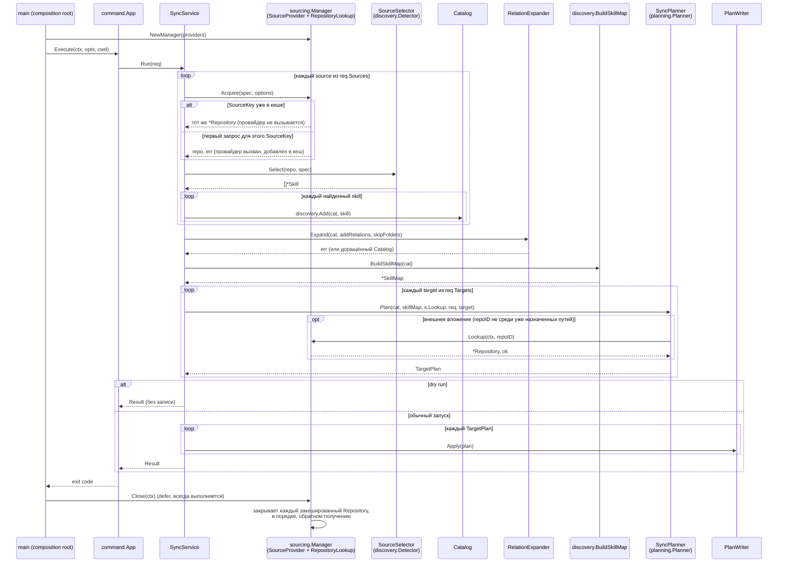
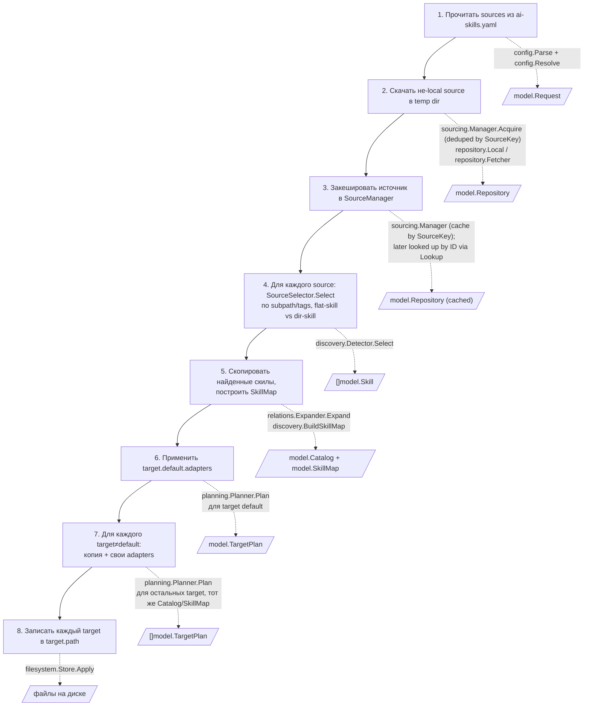
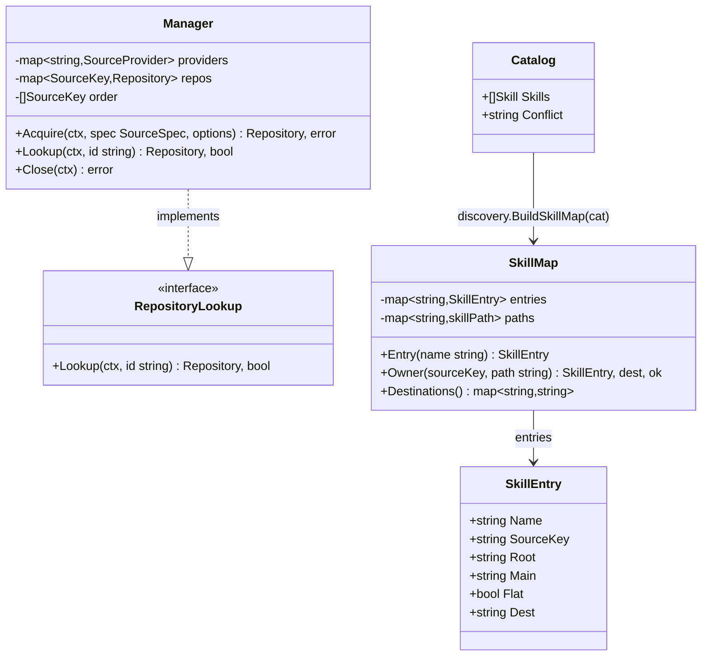

# Диаграммы потока данных sync

Дополняют [автоматический граф пакетов](../features/diagrams/sync.svg)
(`make diagrams`, строится из реальных Go imports и не расходится с кодом).
Диаграммы на этой странице написаны вручную в Mermaid и объясняют порядок
вызовов и контракты данных — то, что граф импортов пакетов не показывает.

## Последовательность SyncService.Run

`sourcing.Manager` живёт **дольше одного `Run`** — его создаёт и закрывает `main`,
не `SyncService.Run`, и играет обе роли: `Acquire` (порт `SourceProvider`,
дедуплицирует по `SourceKey` — тип+путь+ветка, так что два `sources:` с одним
источником, но разными `subpath`/`tags`, скачиваются один раз) и `Lookup` (порт
`RepositoryLookup`, поиск уже полученного `*Repository` по его `ID` — без него
`OutputLayout` не смог бы прочитать содержимое внешнего вложения, зная только
`repoID` из `Link.Target`). `SyncService.Sources` и `SyncService.Lookup` — один и
тот же экземпляр `*sourcing.Manager`, просто через два узких порта. `SkillMap`, в
отличие от `Manager`, строится **один раз за запуск** и переиспользуется без
изменений в цикле по `req.Targets` — `SkillMap.Destinations()` возвращает копию,
которую `OutputLayout` расширяет вложениями конкретной цели, не трогая общий реестр.

## От исходного описания пайплайна к реальным вызовам

Ниже — те же восемь шагов, которыми обычно описывают `sync`, сопоставленные с
функциями, которые их реализуют.

**Важное отличие от буквального прочтения шагов 5–7**: в текущей реализации
нет физической директории «temp skills». Всё от обнаружения до преобразований
каждой цели остаётся в памяти как байты `model.Skill.Files`; `planning.Planner.Plan`
вызывается один раз на каждую цель и независимо пересчитывает выходные байты
из одних и тех же входных данных и общего `SkillMap`. Единственная операция,
которая реально касается диска (кроме исходного clone/download), — это
`PlanWriter.Apply` на шаге 8. Такое решение сознательное: оно проще и быстрее
физического копирования, и весь путь уже покрыт сценариями — см. обсуждение
в [go-cli-migration.md](go-cli-migration.md#правила-зависимостей).

## Контракты RepositoryLookup и SkillMap

| Реестр | Кто пишет | Кто читает | Когда строится |
| --- | --- | --- | --- |
| `sourcing.Manager` (`domain/services/sourcing`) | `main` создаёт; `Acquire` кеширует по `SourceKey` | `SyncService.Run` (порт `SourceProvider`), `OutputLayout` (порт `RepositoryLookup`, поиск по `Repository.ID` для содержимого внешних вложений) | один раз на процесс; переживает несколько `Run`, если бы они были |
| `SkillMap` | `discovery.BuildSkillMap` | `OutputLayout` (назначение выходных путей, включая fallback через `OwnsPath`/`RelativePath` для путей вне инвентаря) | один раз за запуск, сразу после `RelationExpander.Expand` |
| `Catalog` | `discovery.Add` (в цикле acquire), `RelationExpander.Expand` (добавляет связанные скилы) | `discovery.BuildSkillMap`, `SyncPlanner.Plan` | растёт по мере обнаружения и раскрытия связей |

`SkillMap.Owner` сначала ищет точное совпадение среди проинвентаризированных
файлов, а при отсутствии — резолвит через `OwnsPath`/`RelativePath` по
`Root`/`Main`/`Flat` записи, так что путь внутри выбранного directory skill
разрешается даже без явного файла в инвентаре (совместимость с Python,
задокументированная в [compatibility.md](compatibility.md)).
