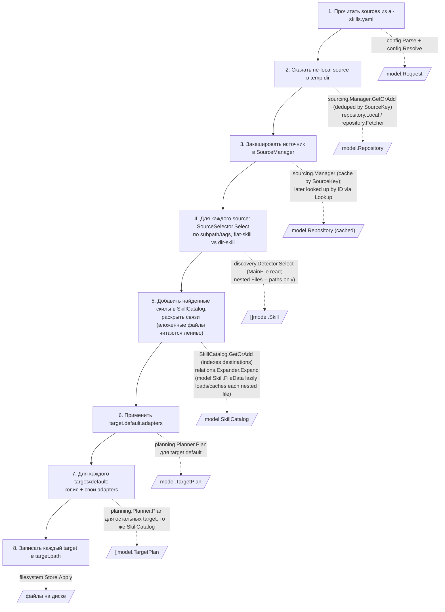
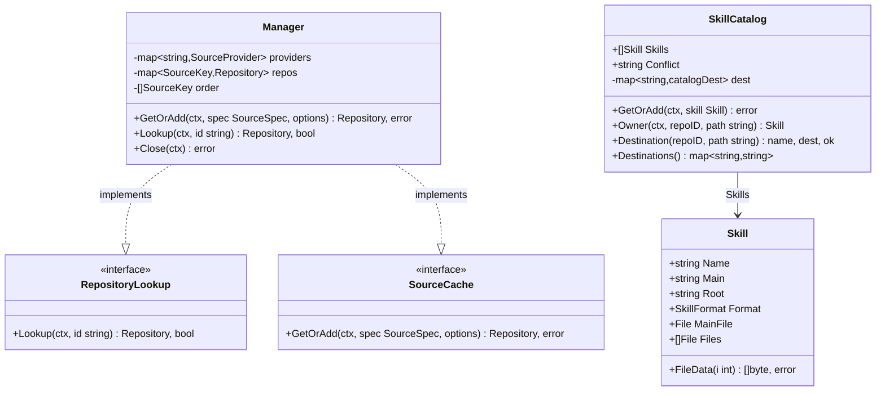

# Диаграммы потока данных sync

Дополняют [автоматический граф пакетов](../features/diagrams/sync.svg)
(`make diagrams`, строится из реальных Go imports и не расходится с кодом).
Диаграммы на этой странице написаны вручную в Mermaid и объясняют порядок
вызовов и контракты данных — то, что граф импортов пакетов не показывает.

## Последовательность SyncService.Run

```mermaid
sequenceDiagram
    participant Main as main (composition root)
    participant CLI as command.App
    participant Sync as SyncService
    participant Mgr as sourcing.Manager<br/>(SourceCache + RepositoryLookup)
    participant Det as SourceSelector<br/>(discovery.Detector)
    participant Cat as SkillCatalog
    participant Sk as *model.Skill
    participant Rel as RelationExpander
    participant Plan as SyncPlanner<br/>(planning.Planner)
    participant Writer as PlanWriter

    Main->>Mgr: NewManager(providers)
    Main->>CLI: Execute(ctx, opts, cwd)
    CLI->>Sync: Run(req)
    loop каждый source из req.Sources
        Sync->>Mgr: GetOrAdd(spec, options)
        alt SourceKey уже в кеше
            Mgr-->>Sync: тот же *Repository (провайдер не вызывается)
        else первый запрос для этого SourceKey
            Mgr-->>Sync: repo, err (провайдер вызван, добавлен в кеш)
        end
        Sync->>Det: Select(repo, spec)
        Det-->>Sync: []*Skill (MainFile.Data заполнен;<br/>Files -- только пути вложенных файлов, Data ещё nil)
        loop каждый найденный skill
            Sync->>Cat: cat.GetOrAdd(ctx, skill)
        end
    end
    Sync->>Rel: Expand(cat, addRelations, skipFolders)
    loop каждый .md-файл (главный сразу; вложенные -- только с расширением .md)
        Rel->>Sk: FileData(i)
        Sk-->>Rel: []byte (читает и кеширует при первом обращении, иначе отдаёт кеш)
    end
    Rel->>Cat: cat.GetOrAdd(ctx, candidate) для каждого связанного скила
    Rel-->>Sync: err (или доращённый SkillCatalog, назначения уже проиндексированы)
    loop каждый target из req.Targets
        Sync->>Plan: Plan(cat, s.Lookup, req, target)
        loop каждый вложенный файл каждого skill
            Plan->>Sk: FileData(i)
            Sk-->>Plan: []byte (кеш переиспользуется между целями и после RelationExpander)
        end
        opt внешнее вложение (repoID не среди уже назначенных путей)
            Plan->>Mgr: Lookup(ctx, repoID)
            Mgr-->>Plan: *Repository, ok
        end
        Plan-->>Sync: TargetPlan
    end
    alt dry run
        Sync-->>CLI: Result (без записи)
    else обычный запуск
        loop каждый TargetPlan
            Sync->>Writer: Apply(plan)
        end
        Sync-->>CLI: Result
    end
    CLI-->>Main: exit code
    Main->>Mgr: Close(ctx) (defer, всегда выполняется)
    Mgr->>Mgr: закрывает каждый закешированный Repository,<br/>в порядке, обратном получению
```

`sourcing.Manager` живёт **дольше одного `Run`** — его создаёт и закрывает `main`,
не `SyncService.Run`, и играет обе роли: `GetOrAdd` (порт `SourceCache`,
дедуплицирует по `SourceKey` — тип+путь+ветка, так что два `sources:` с одним
источником, но разными `subpath`/`tags`, скачиваются один раз) и `Lookup` (порт
`RepositoryLookup`, поиск уже полученного `*Repository` по его `ID` — без него
`OutputLayout` не смог бы прочитать содержимое внешнего вложения, зная только
`repoID` из `Link.Target`). `SyncService.Sources` и `SyncService.Lookup` — один и
тот же экземпляр `*sourcing.Manager`, просто через два узких порта. `SkillCatalog`,
в отличие от `Manager`, не требует отдельного шага построения: каждый `GetOrAdd`
сразу индексирует выходные назначения добавленного скила, и `SkillCatalog.Destinations()`
возвращает копию, которую `OutputLayout` расширяет вложениями конкретной цели,
не трогая общий каталог.

## От исходного описания пайплайна к реальным вызовам

Ниже — те же восемь шагов, которыми обычно описывают `sync`, сопоставленные с
функциями, которые их реализуют.



**Важное отличие от буквального прочтения шагов 5–7**: в текущей реализации
нет физической директории «temp skills». Всё от обнаружения до преобразований
каждой цели остаётся в памяти как байты `model.Skill.MainFile`/`Files`;
`planning.Planner.Plan` вызывается один раз на каждую цель и независимо
пересчитывает выходные байты из одних и тех же входных данных и общего
`SkillCatalog`. Единственная операция, которая реально касается диска (кроме
исходного clone/download), — это `PlanWriter.Apply` на шаге 8. Такое решение
сознательное: оно проще и быстрее физического копирования, и весь путь уже
покрыт сценариями — см. обсуждение в
[go-cli-migration.md](go-cli-migration.md#правила-зависимостей).

## Контракты RepositoryLookup и SkillCatalog



| Реестр | Кто пишет | Кто читает | Когда строится |
| --- | --- | --- | --- |
| `sourcing.Manager` (`domain/services/sourcing`) | `main` создаёт; `GetOrAdd` кеширует по `SourceKey` | `SyncService.Run` (порт `SourceCache`), `OutputLayout` (порт `RepositoryLookup`, поиск по `Repository.ID` для содержимого внешних вложений) | один раз на процесс; переживает несколько `Run`, если бы они были |
| `SkillCatalog` | `SyncService.Run` (в цикле acquire), `RelationExpander.Expand` (добавляет связанные скилы) — оба через `GetOrAdd` | `RelationExpander.Expand` (`Owner`), `OutputLayout`/`SyncPlanner.Plan` (`Destination`/`Destinations`) | растёт по мере обнаружения и раскрытия связей; каждый `GetOrAdd` сразу индексирует назначения добавленного скила — отдельного шага построения нет |
| `Skill.Files[i].Data` (кеш внутри самого `*Skill`, не отдельный реестр) | `Skill.FileData(i)` — читает из `Repository.FS` и кеширует в `Files[i].Data` при первом обращении | `RelationExpander.Expand` (только `.md`-файлы, при раскрытии ссылок), `SyncPlanner.Plan` (все вложенные файлы, при подготовке `OutputFile`) | лениво, при первом реальном обращении к байтам конкретного файла — `MainFile.Data` в это разделение не входит, читается сразу `Detector.makeSkill`-ом |

`SkillCatalog.Destination` сначала ищет точное совпадение среди
проиндексированных `GetOrAdd`-ом путей, а при отсутствии — резолвит через
`OwnsPath`/`RelativePath` по `Root`/`Main`/`Format` скила, так что путь внутри
выбранного directory skill разрешается даже без явного файла в индексе
(совместимость с Python, задокументированная в [compatibility.md](compatibility.md)).
