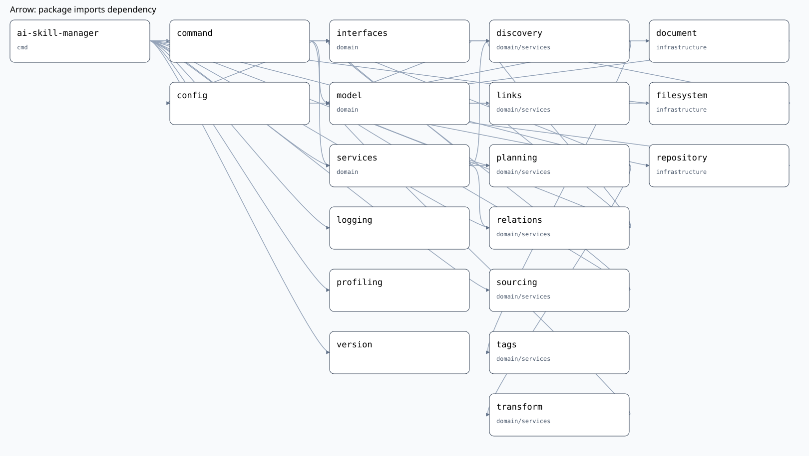

# Синхронизация скилов

Одна публичная команда `sync` собирается из перечисленных ниже единиц.
[Архитектура](../architecture/go-cli-migration.md) объясняет порядок вызовов;
[справочник](../api/reference.md) задаёт пользовательский контракт.

## Возможности

| Возможность | Основные единицы |
| --- | --- |
| YAML/JSON и CLI | Arguments, ConfigLoader, OptionResolver, SyncCommand |
| Local / GitHub | LocalSource, RepositoryFetcher, GitCloner, ArchiveFetcher, SourceManager, RepositoryLookup |
| Форматы и фильтры | SkillDetector, SourceSelector, TagExpression, SkillCatalog |
| Связи и вложения | FileInventory, LinkExtractor, LinkExclusion, LinkResolver, RelationExpander |
| Выходные файлы | SkillMap, OutputLayout, LinkRewriter, ClaudeTransformer, FrontmatterCodec |
| Incremental / force / orphans | Fingerprint, SyncPlanner, StateReader, PlanApplier |
| Dry-run и lifecycle | SyncService, ResultFormatter, Logging, Profiling |

## Модули

Ссылка на реализацию ведёт к ответственному файлу; test cases — к условиям
и ожидаемым результатам пакета. В TESTS.md того же пакета указаны реальные
Gherkin-сценарии и проверки. Общий код тестового запуска — `tools/testsupport`.

| Единица | Вид | Ответственность и реализация | Зависимости | Test cases |
| --- | --- | --- | --- | --- |
| Arguments | Function | [Parse](../../internal/command/arguments.go) — Разбирает аргументы CLI | нет | [условия](../../internal/command/usecases.md), [сценарии](../../internal/command/TESTS.md) |
| ConfigLoader | Service | [Parse](../../internal/config/config.go) — Декодирует конфигурацию с defaults | YAML decoder | [условия](../../internal/config/usecases.md), [сценарии](../../internal/config/TESTS.md) |
| OptionResolver | Function | [Resolve](../../internal/config/resolve.go) — Вычисляет эффективный запрос | базовый путь и overrides | [условия](../../internal/config/usecases.md), [сценарии](../../internal/config/TESTS.md) |
| SyncCommand | Command | [App.Execute](../../internal/command/sync.go) — Связывает команду с синхронизацией | чтение конфига, SyncService, output streams | [условия](../../internal/command/usecases.md), [сценарии](../../internal/command/TESTS.md) |
| ResultFormatter | Function | [PrintResult](../../internal/command/format.go) — Представляет план в консоли | io.Writer | [условия](../../internal/command/usecases.md), [сценарии](../../internal/command/TESTS.md) |
| SyncService | Orchestrator | [SyncService.Run](../../internal/domain/services/sync.go) — Координирует стадии одного запуска | SourceProvider, RepositoryLookup, SourceSelector, RelationExpander, SyncPlanner, PlanWriter (порты); строит SkillMap; не управляет временем жизни источников | [условия](../../internal/domain/services/usecases.md), [сценарии](../../internal/domain/services/TESTS.md) |
| LocalSource | Service | [Local.Acquire](../../internal/infrastructure/repository/local.go) — Открывает локальное дерево, определяет `Repository.SingleFile` | os.Root / fs.FS | [условия](../../internal/infrastructure/repository/usecases.md), [сценарии](../../internal/infrastructure/repository/TESTS.md) |
| RepositoryFetcher | Service | [Fetcher.Acquire](../../internal/infrastructure/repository/fetch.go) — Предоставляет временную копию репозитория, регистрирует очистку через `Repository.AddCloser` | Cloner, ArchiveFetcher, временная директория | [условия](../../internal/infrastructure/repository/usecases.md), [сценарии](../../internal/infrastructure/repository/TESTS.md) |
| GitCloner | Service | [GitCloner.Clone / GitProcess.Run](../../internal/infrastructure/repository/git.go) — Получает ветку или тег через Git | ProcessRunner | [условия](../../internal/infrastructure/repository/usecases.md), [сценарии](../../internal/infrastructure/repository/TESTS.md) |
| ArchiveFetcher | Service | [Archive.Fetch](../../internal/infrastructure/repository/archive.go) — Предоставляет дерево из GitHub tar.gz | HTTPClient, ограниченный файловый корень | [условия](../../internal/infrastructure/repository/usecases.md), [сценарии](../../internal/infrastructure/repository/TESTS.md) |
| SourceManager | Service | [Manager.Acquire / Lookup / Close](../../internal/domain/services/sourcing/manager.go) — Кеширует `Repository` по `SourceKey`, диспетчеризует по типу, владеет их временем жизни; не выполняет I/O сама, только делегирует зарегистрированным `SourceProvider` | LocalSource, RepositoryFetcher (по типу, через порт) | [условия](../../internal/domain/services/sourcing/usecases.md), [сценарии](../../internal/domain/services/sourcing/TESTS.md) |
| RepositoryLookup | Port | [Lookup](../../internal/domain/interfaces/ports.go) — Находит уже полученный `Repository` по `ID`; реализован `Manager.Lookup` | нет | [условия](../../internal/domain/services/sourcing/usecases.md), [сценарии](../../internal/domain/services/sourcing/TESTS.md) |
| SkillDetector | Service | [Detector.Discover / Rooted / Find](../../internal/domain/services/discovery/detector.go) — Распознаёт расположение скила | DocumentCodec, fs.FS | [условия](../../internal/domain/services/discovery/usecases.md), [сценарии](../../internal/domain/services/discovery/TESTS.md) |
| SourceSelector | Function | [Detector.Select](../../internal/domain/services/discovery/source.go) — Выбирает скилы источника по `SourceSpec`, резолвит scan paths (`scanPaths`) | Detector, TagExpression | [условия](../../internal/command/usecases.md), [сценарии](../../internal/command/TESTS.md) |
| TagExpression | Function | [Match](../../internal/domain/services/tags/tags.go) — Вычисляет фильтр тегов | нет | [условия](../../internal/domain/services/tags/usecases.md), [сценарии](../../internal/domain/services/tags/TESTS.md) |
| SkillCatalog | Service | [Add / Owner](../../internal/domain/services/discovery/catalog.go) — Разрешает коллизии скилов (тип `Catalog` — `domain/model`) | модели каталога | [условия](../../internal/command/usecases.md), [сценарии](../../internal/command/TESTS.md) |
| FileInventory | Function | [Files / Owns / Relative / Tags](../../internal/domain/services/discovery/inventory.go) — Описывает файлы и принадлежность скила | fs.FS | [условия](../../internal/command/usecases.md), [сценарии](../../internal/command/TESTS.md) |
| LinkExtractor | Function | [Extract](../../internal/domain/services/links/extract.go) — Извлекает диапазоны ссылок | нет | [условия](../../internal/domain/services/links/usecases.md), [сценарии](../../internal/domain/services/links/TESTS.md) |
| LinkExclusion | Function | [Excluded](../../internal/domain/services/links/exclusion.go) — Определяет исключения проверки ссылки | нет | [условия](../../internal/domain/services/links/usecases.md), [сценарии](../../internal/domain/services/links/TESTS.md) |
| LinkResolver | Function | [Resolve](../../internal/domain/services/links/resolve.go) — Определяет путь адресата | fs.FS, knownOwner predicate | [условия](../../internal/domain/services/links/usecases.md), [сценарии](../../internal/domain/services/links/TESTS.md) |
| RelationExpander | Service | [Expander.Expand](../../internal/domain/services/relations/expand.go) — Строит замыкание связанных скилов | Detector, Catalog, LinkResolver | [условия](../../internal/domain/services/relations/usecases.md), [сценарии](../../internal/domain/services/relations/TESTS.md) |
| SkillMap | Function | [BuildSkillMap](../../internal/domain/services/discovery/skillmap.go) / [SkillMap.Owner](../../internal/domain/model/skill_map.go) — Строит итоговый реестр «имя → источник → путь» один раз после RelationExpander | Catalog | [условия](../../internal/domain/model/usecases.md), [сценарии](../../internal/domain/model/TESTS.md) |
| OutputLayout | Function | [BuildLayout](../../internal/domain/services/planning/layout.go) — Назначает выходные пути | Catalog, SkillMap, RepositoryLookup (для внешних вложений) | [условия](../../internal/domain/services/planning/usecases.md), [сценарии](../../internal/domain/services/planning/TESTS.md) |
| LinkRewriter | Function | [Rewrite](../../internal/domain/services/transform/links.go) — Заменяет адреса ссылок по layout | нет | [условия](../../internal/domain/services/transform/usecases.md), [сценарии](../../internal/domain/services/transform/TESTS.md) |
| ClaudeTransformer | Function | [Claude](../../internal/domain/services/transform/claude.go) — Преобразует свойства Claude | нет | [условия](../../internal/domain/services/transform/usecases.md), [сценарии](../../internal/domain/services/transform/TESTS.md) |
| Fingerprint | Function | [Fingerprint](../../internal/domain/services/planning/fingerprint.go) — Вычисляет отпечаток результата | готовые OutputFile | [условия](../../internal/domain/services/planning/usecases.md), [сценарии](../../internal/domain/services/planning/TESTS.md) |
| SyncPlanner | Service | [Planner.Plan](../../internal/domain/services/planning/planner.go) — Определяет операции обновления цели | Catalog, SkillMap, RepositoryLookup, StateReader, DocumentCodec, OutputLayout, преобразования | [условия](../../internal/domain/services/planning/usecases.md), [сценарии](../../internal/domain/services/planning/TESTS.md) |
| PlanApplier | Service | [Store.Apply](../../internal/infrastructure/filesystem/apply.go) — Применяет готовый план | os.Root | [условия](../../internal/infrastructure/filesystem/usecases.md), [сценарии](../../internal/infrastructure/filesystem/TESTS.md) |
| StateReader | Service | [Store.Snapshot](../../internal/infrastructure/filesystem/store.go) — Читает управляемое состояние цели | os.Root | [условия](../../internal/infrastructure/filesystem/usecases.md), [сценарии](../../internal/infrastructure/filesystem/TESTS.md) |
| FrontmatterCodec | Service | [Codec.Decode / Encode](../../internal/infrastructure/document/codec.go) — Преобразует frontmatter в модель | YAML codec | [условия](../../internal/infrastructure/document/usecases.md), [сценарии](../../internal/infrastructure/document/TESTS.md) |
| Logging | Function | [Init](../../internal/logging/logger.go) — Настраивает process logger | stderr writer, debug option | [условия](../../internal/logging/usecases.md), [сценарии](../../internal/logging/TESTS.md) |
| Profiling | Function | [Start](../../internal/profiling/profile.go) — Управляет CPU profile | runtime/pprof, файл | [условия](../../internal/profiling/usecases.md), [сценарии](../../internal/profiling/TESTS.md) |

### Модели, порты, composition root

- [model](../../internal/domain/model/model.go): Request → Repository/Skill/Link → TargetPlan → Result; ошибки Issue/Issues. Также [Catalog](../../internal/domain/model/catalog.go), [SkillMap/SkillEntry](../../internal/domain/model/skill_map.go) и примитивы [OwnsPath/RelativePath](../../internal/domain/model/ownership.go).
- [interfaces](../../internal/domain/interfaces/ports.go): SourceProvider, RepositoryLookup, DocumentCodec, StateReader, PlanWriter, SourceSelector, RelationExpander, SyncPlanner. Получатель порта определяет необходимую роль.
- [main](../../cmd/ai-skill-manager/main.go): реальные адаптеры, constructor injection, сигналы, profiler, exit code; создаёт `sourcing.Manager` и владеет его временем жизни (`defer sources.Close(ctx)`).
- [version](../../internal/version/version.go): build-time значение из VERSION; без отдельной бизнес-логики.

## Использование единиц

1. Arguments и SyncCommand получают вызов пользователя. ConfigLoader и OptionResolver создают Request.
2. `main` создаёт один `sourcing.Manager` на весь процесс и связывает его с SyncService
   сразу как SourceProvider и как RepositoryLookup (`Sources`/`Lookup` — один и тот
   же экземпляр). SyncService получает источники через него (Manager отдаёт кеш по
   `SourceKey`, реально получая источник только на первый запрос — сам делегируя
   LocalSource/RepositoryFetcher, а не выполняя I/O напрямую), вызывает
   SourceSelector и SkillCatalog.
3. RelationExpander обходит Markdown; LinkResolver находит владельца или внешнее вложение.
4. SkillMap строится один раз после RelationExpander и переиспользуется для каждой цели.
5. SyncPlanner строит все TargetPlan, читая StateReader и используя SkillMap; для
   содержимого внешних вложений вызывает RepositoryLookup.Lookup по `Repository.ID`
   вместо отдельного реестра. OutputLayout и преобразования готовят окончательные
   байты; переписывание ссылок применяется только когда `link-adapter` присутствует
   в адаптерах цели.
6. Dry-run возвращает планы. Обычный запуск передаёт планы PlanApplier.
7. ResultFormatter выводит результат. `main` закрывает `sourcing.Manager` (`defer
   sources.Close(ctx)`) после `Execute`, независимо от результата — SyncService.Run
   больше не управляет временем жизни источников само.

## Диаграмма

[JSON Canvas](diagrams/sync.canvas) и SVG генерируются командой `make diagrams`
через локальный [diagram-renderer](../../tools/diagram-renderer/main.go).
`depends_on` задаёт состав, Go imports — связи; стрелка означает «импортирует».
Диаграмма показывает зависимости типов/пакетов, порядок выполнения приведён выше.
Порядок вызовов и контракты `RepositoryLookup`/`SkillMap` — в
[диаграммах потока данных](../architecture/diagrams.md) (Mermaid, вручную).
